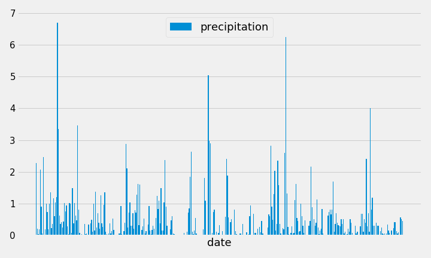
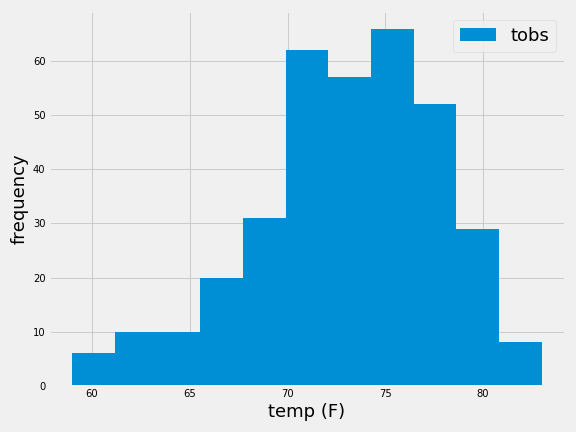
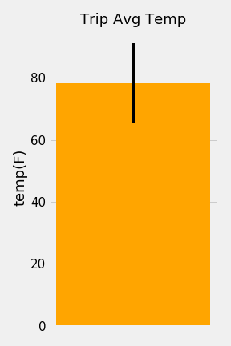

# advanced_data_storage_and_retrieval
use sqlalchemy, pandas and matplotlib to deal with daily climate data (precipitation and temperature) in Hawaii from 01/01/2010 to 08/23/2017, recorded in 9 different stations.

* Analysis

The daily precipitation data from 08/24/2016 to 08/23/2017, recorded in 9 different stations

The histogram of temperature distribution to temperature data recorded from 08/24/2016 to 08/23/2017 at the busiest station (USC00519281)

The average temperature according to the tempaerature recorded from 07/01 to 07/07 each year (from 2010 to 2017)

* files:
 * climate.ipynb: use sqlalchemy, pandas and matplotlib to analyze the daily climate data in Hawaii. Results are shown in the above figures
 * app.py: return the climate query results in a json file including:
   1. daily precipitation data
   2. list of stations
   3. temperature data from 08/24/2016 to 08/23/2017
   4. query for min, average, max temperature for all dates greater than and equal to the query date
   5. query for min, average, max temperature for for dates between the start and end date inclusive.

